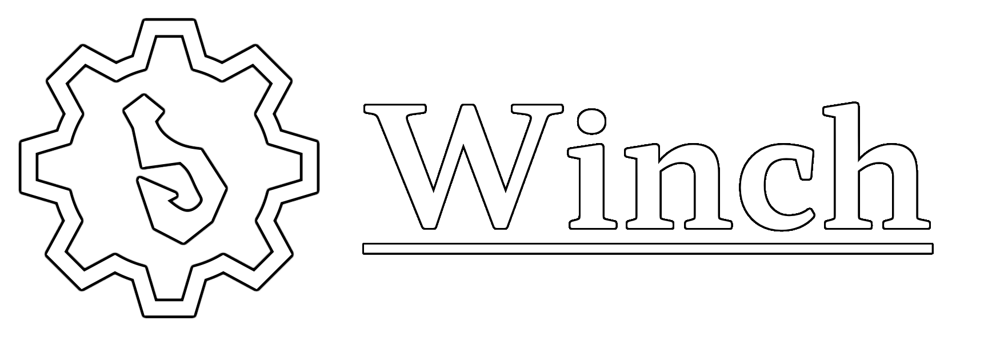

**Winch** is intended to be a Mod Loader for the game DREDGE. It is currently heavily under development and there are many improvements to come. As of right now, it's not considered ready for use and there will not be any documentation or instructions until this changes.

## Roadmap

- [x] Code Execution when booting DREDGE
- [x] Basic Configuration Options for Winch
- [x] Loading separate Mod Assemblies at runtime
- [x] Standardized Mod Format (Metadata JSON File)
- [ ] Provide API to Mod Assemblies to interface with the game
- [ ] Documentation & Examples
